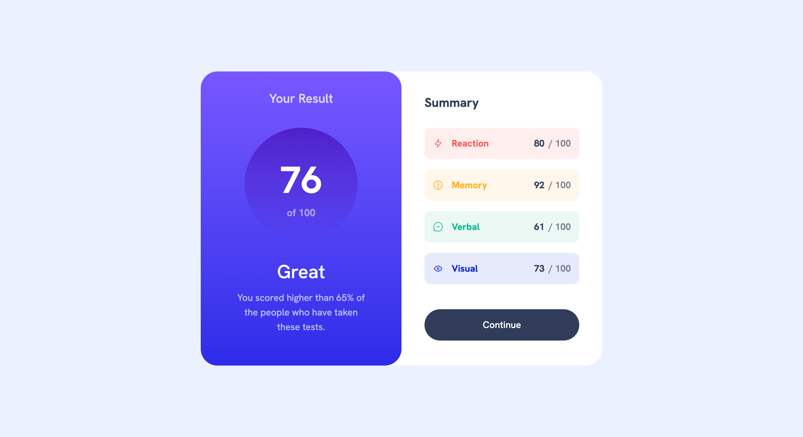

# Frontend Mentor - Results summary component solution

This is a solution to the [Results summary component challenge on Frontend Mentor](https://www.frontendmentor.io/challenges/results-summary-component-CE_K6s0maV). Frontend Mentor challenges help you improve your coding skills by building realistic projects. 

## Table of contents

- [Overview](#overview)
  - [The challenge](#the-challenge)
  - [Screenshot](#screenshot)
  - [Links](#links)
- [My process](#my-process)
  - [Built with](#built-with)
  - [What I learned](#what-i-learned)
  - [Continued development](#continued-development)
- [Author](#author)

## Overview

### The challenge

Users should be able to:

- View the optimal layout for the interface depending on their device's screen size
- See hover and focus states for all interactive elements on the page

### Screenshot

### Links

- Solution URL: [View repo](https://github.com/VeyronShark/FrontendMentor-result-summary-component)
- Live Site URL: [View site](https://veyronshark.github.io/FrontendMentor-result-summary-component/)

## My process

### Built with

- Semantic HTML5 markup
- Flexbox
- Mobile-first workflow
- [TailwindCSS](https://tailwindcss.com/)

### What I learned

I have learnt a lot:

- For the first time, I used tailwind css for a project
- I learnt how to install and runn tailwind
- I learnt how to configure tailwind
- I got great tailwind practice 
- I understood the concept of linear gradients while finding out how to achieve the linear gradient

### Continued development

This code can be made more responsive. It currently looks terrible just at the media query (around 770px).
Sizes can be made on percentage or view widths.

## Author

- Frontend Mentor - [@VeyronShark](https://www.frontendmentor.io/profile/VeyronShark)
- GitHub - [@VeyronShark](https://github.com/VeyronShark)